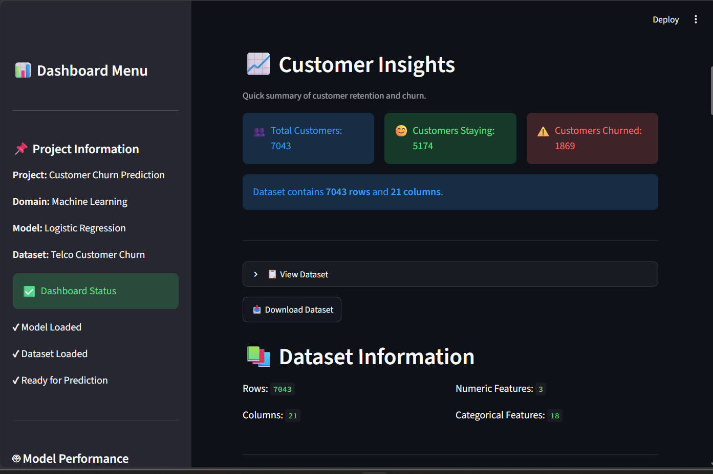
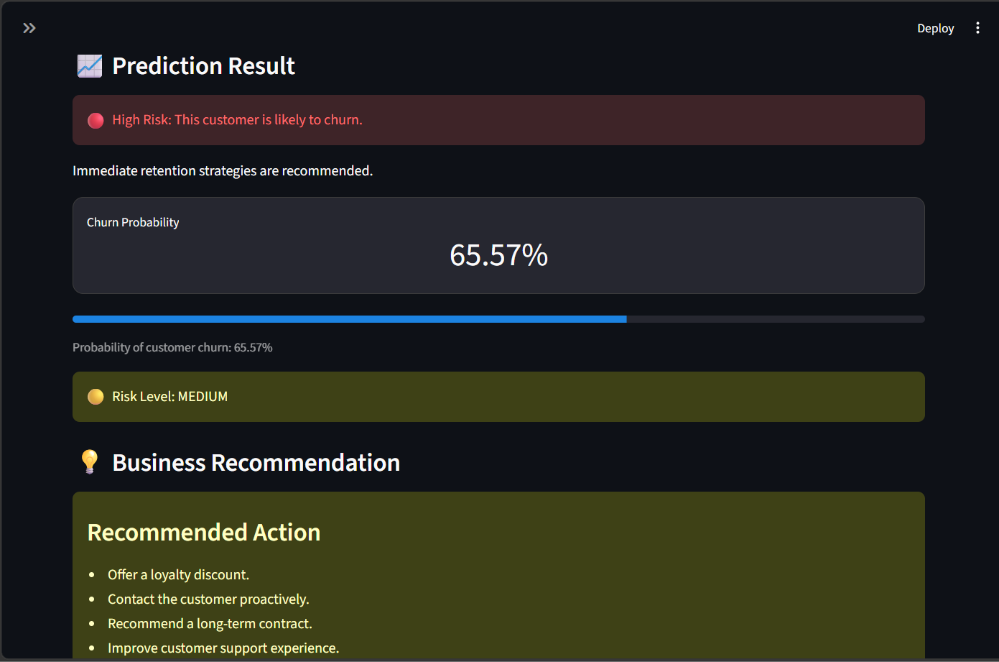
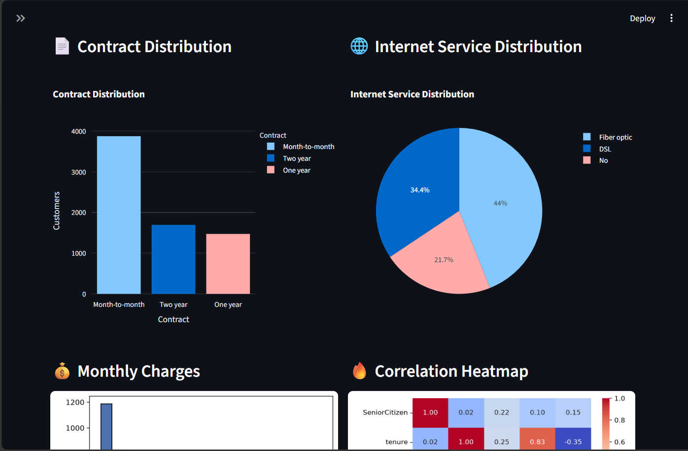

# 📊 Customer Churn Prediction Dashboard


---

## 📌 Project Overview

Customer churn is one of the biggest challenges faced by telecom companies. Retaining existing customers is often more cost-effective than acquiring new ones.

This project uses **Machine Learning** to predict whether a customer is likely to churn based on demographic information, service usage, contract details, and billing history. An interactive **Streamlit dashboard** allows users to make predictions, explore business insights, and visualize customer behavior.

---

## 🎯 Objectives

- Predict customer churn using Machine Learning.
- Build an interactive business dashboard.
- Visualize customer behavior through analytics.
- Support business decision-making with predictive insights.

---

## 📂 Dataset

**Dataset:** Telco Customer Churn Dataset

The dataset contains customer information such as:

- Customer demographics
- Account information
- Internet services
- Phone services
- Contract type
- Billing information
- Customer churn status

---

## 🤖 Machine Learning Model

**Algorithm Used**

- Logistic Regression

**Workflow**

- Data Cleaning
- Missing Value Handling
- Feature Encoding
- Model Training
- Model Evaluation
- Model Serialization using Joblib
- Deployment with Streamlit

---

## 📊 Dashboard Features

### 📈 Business Overview
- Total Customers
- Churn Rate
- Average Tenure
- Average Monthly Charges

### 👥 Customer Insights
- Customer Statistics
- Dataset Information
- Dataset Search
- Dataset Download

### 🔮 Customer Prediction
- Customer Information Form
- Churn Prediction
- Churn Probability
- Risk Level Indicator
- Business Recommendation

### 📉 Interactive Analytics
- Contract Distribution
- Internet Service Distribution
- Monthly Charges Distribution
- Correlation Heatmap
- Feature Importance Analysis
- Top Influential Features

### 📄 Reports
- Download Prediction Report
- Download Dataset

---

## 🛠 Technologies Used

- Python
- Streamlit
- Pandas
- NumPy
- Scikit-learn
- Matplotlib
- Seaborn
- Plotly
- Joblib

---

## 📁 Project Structure

```text
Customer_Churn_Project/
│
├── app.py
├── train_model.py
├── churn_model.pkl
├── feature_columns.pkl
├── Telco_Customer_Churn_Dataset.csv
├── requirements.txt
├── README.md
│
├── notebook/
│   └── Customer_Churn_Analysis.ipynb
│
├── screenshots/
│   ├── dashboard.png
│   ├── prediction.png
│   └── analytics.png
│
└── assets/
```

---

## 📷 Dashboard Preview

### Dashboard Home



---

### Customer Prediction



---

### Analytics Dashboard



---

## 🚀 Installation

Clone the repository

```bash
git clone https://github.com/YOUR_USERNAME/Customer-Churn-Dashboard.git
```

Go to the project directory

```bash
cd Customer-Churn-Dashboard
```

Install dependencies

```bash
pip install -r requirements.txt
```

Run the application

```bash
streamlit run app.py
```

---

## 💼 Business Applications

- Customer Retention Strategy
- Targeted Marketing
- Risk Identification
- Customer Relationship Management
- Revenue Optimization

---

## 🔮 Future Enhancements

- Deploy on Streamlit Community Cloud
- Compare multiple ML algorithms
- Add SHAP explainability
- Connect to a live database
- Build an admin dashboard

---

## 👤 Author

**Aseem S**

Machine Learning | Data Science | Statistics | Python | SQL

---

⭐ If you found this project useful, consider giving it a star!